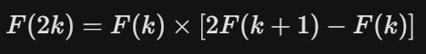

# Fibonacci Parallel

**Giải Pháp: Fibonacci Mở Rộng & Tính Toán Song Song**

Tài liệu này mô tả thuật toán và kỹ thuật lập trình được sử dụng để giải quyết bài toán tính số Fibonacci mở rộng với số lượng truy vấn lớn (N=10^6) và giá trị chỉ số lớn (A_i=2 x 10^8).

1. Phân tích
    
    Dãy số đề bài đưa ra ($F_{ext}$) có dạng: 
    
    F1 = 1, F2 = 2, F3 = 3, F4 = 5, F5 = 8,…
    
    So sánh với dãy Fibonacci chuẩn (F_std: 0, 1, 1, 2, 3, 5, 8...):
    
    F_ext(1) = 1 = F_std(2)
    
    F_ext(2) = 2 = F_std(3)
    
    F_ext(3) = 3 = F_std(4)
    
    ⇒ Để tìm số thứ A của đề bài, ta cần tính số Fibonacci chuẩn thứ **A+1**
    
2. Thuật Toán: Fast Doubling (Nhân Đôi Nhanh)
    
    Vì A_i lên tới 2 x 10^8, độ phức tạp O(n) là quá chậm. Ta sử dụng phương pháp **Fast Doubling** để đạt độ phức tạp **O(log n)**
    
    **Công thức truy hồi**
    Thay vì tính lần lượt, ta tính nhảy cóc dựa trên các cặp số (F_k, F_k+1):
    
    Công thức nhân đôi (k → 2k):
    
    
    
    Công thức lẻ (k → 2k+1):
    
    
    
    Tất cả các phép tính đều được thực hiện kèm theo toán tử modulo Q để tránh tràn số.
    
3. Kiến Trúc Song Song (Parallel Processing)
Để xử lý 10^6 truy vấn trong thời gian giới hạn, giải pháp sử dụng mô hình **Data Parallelism** (Song song dữ liệu) để tận dụng đa nhân CPU, vượt qua giới hạn GIL (Global Interpreter Lock) của Python.
Luồng xử lý (Workflow):
    1. Main Process:
        
        Đọc toàn bộ dữ liệu Input.
        
        Chia danh sách N truy vấn thành các phần nhỏ (**Chunks**). Kích thước mỗi chunk = N / số_nhân_CPU.
        
    2. Worker Processes:
        
        Mỗi nhân CPU nhận một chunk.
        
        Tính toán độc lập bằng thuật toán Fast Doubling.
        
    3. Aggregation:
    Main Process thu thập kết quả từ các Workers và gộp lại thành danh sách kết quả cuối cùng.